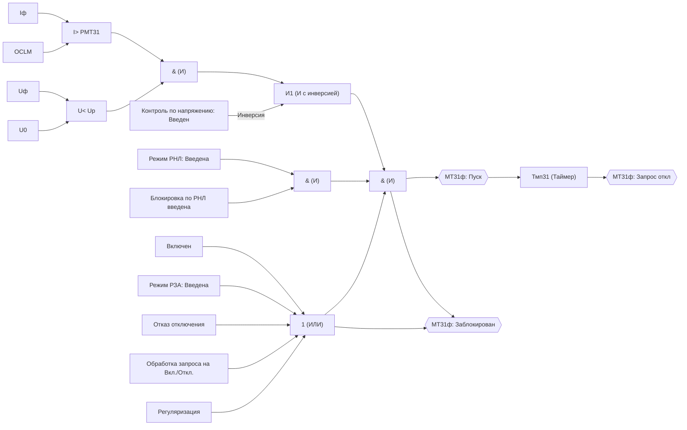

| ![[МТЗ.canvas]] |
| --------------- |
|                 |

```mermaid
flowchart LR
    %% Входы
    Iф["Iф"]
    OCLM["OCLM"]
    Uф["Uф"]
    U0["U0"]
    Kontrol["Контроль по напряжению: Введен"]
    Vklyuchen["Включен"]
    RezhimRZA["Режим РЗА: Введена"]
    Otkaz["Отказ отключения"]
    Obrabotka["Обработка запроса на Вкл./Откл."]
    Regulyarizaciya["Регуляризация"]
    RezhimRNL["Режим РНЛ: Введена"]
    BlokirovkaRNL["Блокировка по РНЛ введена"]
    %% Логические элементы
    I_PMT31["I> PMT31"]
    U_Up["U< Up"]
    AND_top["& (И)"]
    AND_inv["И1 (И с инверсией)"]
    AND_bottom["& (И)"]
    OR_mid["1 (ИЛИ)"]
    AND_big["& (И)"]
    %% Выходы
    Start{{"MT31ф: Пуск"}}
    Timer["Тмп31 (Таймер)"]
    TripReq{{"MT31ф: Запрос откл"}}
    Blocked{{"MT31ф: Заблокирован"}}
    %% Связи
    Iф --> I_PMT31
    OCLM --> I_PMT31
    Uф --> U_Up
    U0 --> U_Up
    I_PMT31 --> AND_top
    U_Up --> AND_top
    AND_top --> AND_inv
    Kontrol -->|Инверсия| AND_inv
    RezhimRNL --> AND_bottom
    BlokirovkaRNL --> AND_bottom
    Vklyuchen --> OR_mid
    RezhimRZA --> OR_mid
    Otkaz --> OR_mid
    Obrabotka --> OR_mid
    Regulyarizaciya --> OR_mid
    AND_inv --> AND_big
    AND_bottom --> AND_big
    OR_mid --> AND_big
    AND_big --> Start
    AND_big --> Blocked
    OR_mid --> Blocked
    Start --> Timer
    Timer --> TripReq
```

